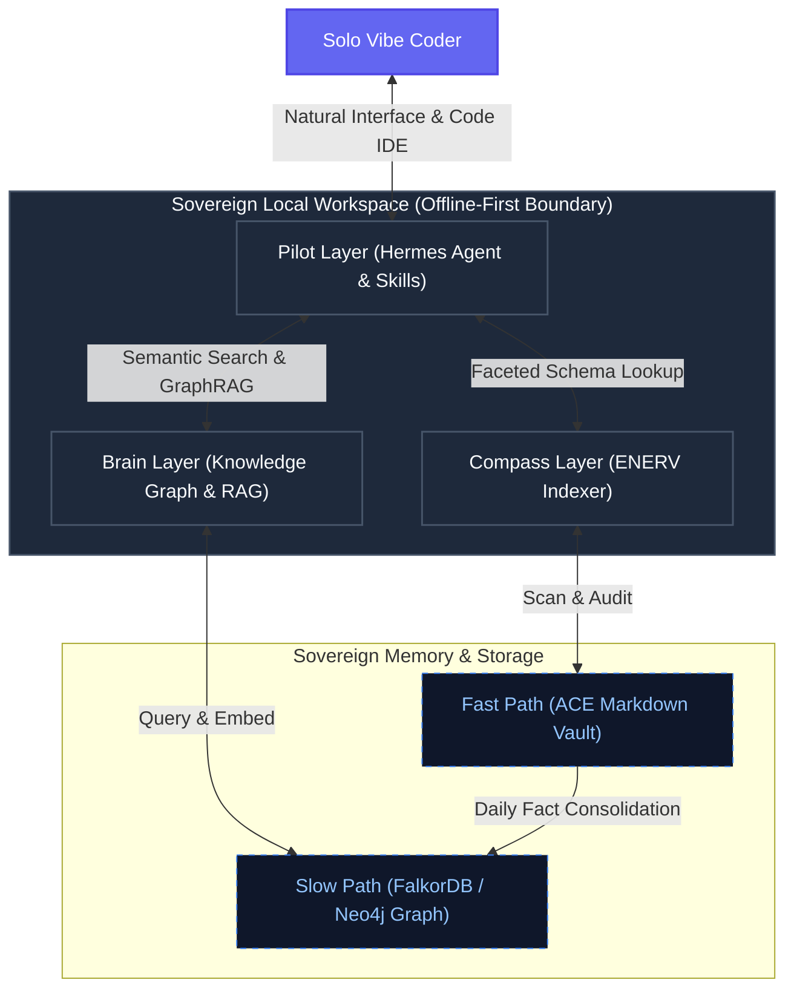

# Introduction: The Nautilus Project

**Nautilus** is a next-generation, local-first autonomous computing environment designed for the **Solo Vibe Coder**. It represents a fundamental shift from fragmented tools and disparate text archives to a unified, self-healing **Sovereign Personal Knowledge Mesh & Data Graph**.

## What is Nautilus?

Nautilus is not just a tool; it is an integrated ecosystem that harmonizes three core capacities of autonomous productivity:

1. **Systemic Intelligence (The Compass - ENERV)**: Constant ambient awareness of where everything is and what it represents. It provides context mapping, tags tracking, and schema-first metadata validation.
2. **Visual Intuition (The Brain - Knowledge Graph & RAG)**: The visual, semantic web that maps how your notes, tools, and code connect across multiple dimensions in a 3D physical or semantic space.
3. **Agentic Action (The Pilot - Hermes Agent)**: The execution gateway that orchestrates sub-agents (Aider, Cline, Claude Code) through strictly bounded context windows and DeepVista skill definitions.

## The Problem: Context Fragmentation

As solo developers, we suffer from intense **context fragmentation**. Our ideas are trapped in notes vaults, our codebase metadata is lost in directories, and our autonomous AI agents lack a unified, bitemporal view of our technical goals and personal knowledge. This forces us to copy-paste prompts, rebuild context maps manually, and manage fragile pathways.

## The Solution: A High-Fidelity Context Layer

Nautilus builds a **High-Fidelity Context Layer** that bridges the gap between raw files and agentic reasoning. By operating locally-first, it turns your entire workspace directory into a searchable, navigable, and actionable graph.

---
*Welcome to the era of Sovereign Computing.*
