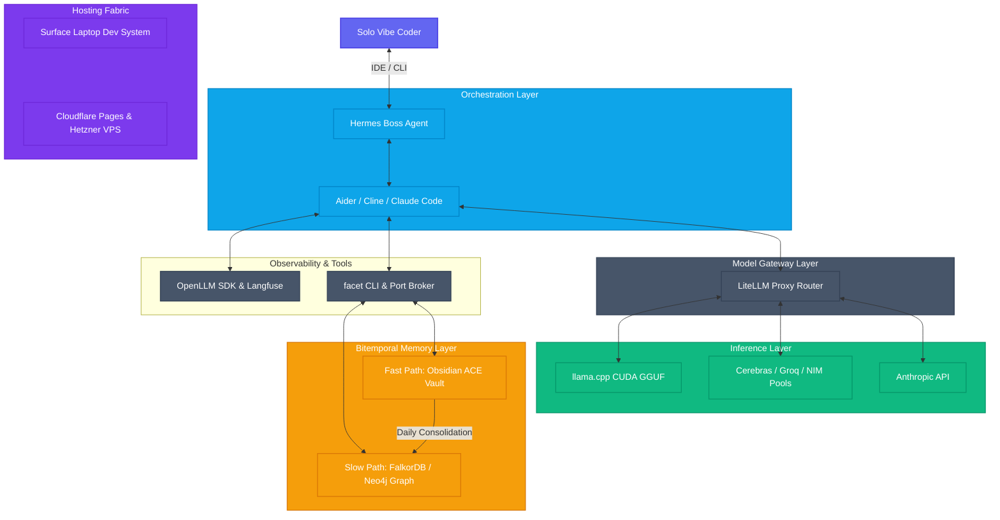

# Architecture Overview

Nautilus follows a **Modular Monorepo Architecture**, separating operational concerns while maintaining a unified bitemporal state across directories.



## The Three Core Layers

### 1. The Metadata Layer (The Compass)
Located in `/core/enerv`. This layer provides systemic environmental awareness. It uses **Faceted Indexing** to categorize every folder on your disk. Rather than analyzing file contents, ENERV looks *around* the files (analyzing metadata schemas, tag hierarchies, team assignments, and project execution priority).

### 2. The Semantic Layer (The Brain)
Located in `/apps/knowledge-graph`. This layer interprets the semantic "meaning" of your data. It uses vector embeddings to map hidden connections between disparate text files and stores them as an active Knowledge Graph inside a Graph Database (Neo4j/FalkorDB).

### 3. The Orchestration Layer (The Pilot)
Located in `/hermes`. This layer is the execution engine. It utilizes a central orchestrator and highly specialized coding agents (Aider, Cline) to execute refactoring tasks and workflows based on the structured context injected from the Compass and Brain layers.

## Data Flow: The Ingestion Pipeline

1. **Discovery**: The `facet` CLI walks the directories to map projects.
2. **Classification**: Local `.facets/meta.json` files define metadata contracts.
3. **Ingestion**: The `facet ingest` Python command processes the file (chunking, cleaning).
4. **Embedding**: Google Gemini or local embedding models generate high-fidelity vector representations.
5. **Graph Construction**: Neo4j builds structured `Document` nodes and dynamically maps `SIMILAR_TO` edges.
6. **Visualization**: Next.js renders the live 3D semantic nodes web for the coder.

## Directory Structure

The Nautilus monorepo is cleanly separated into modular functional folders:

```text
NAUTILUS/
├── apps/               # Web interfaces (Next.js 3D Force Graph)
├── core/               # Systemic indexing & CLI tools (Python/ENERV)
├── config/             # Shared service registries & environment configs
├── scripts/            # Port broker & automation bootstrap files
├── hermes/             # Agent skills & orchestration loops
└── docs/               # Architecture documents & white papers
```
