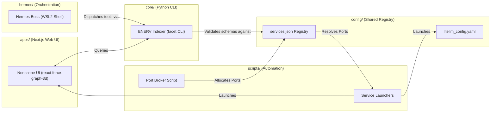

# Core Components

The Nautilus monorepo is divided into highly specialized, loosely coupled modules that share state through environment variables, dynamic port allocation, and standardized JSON schemas.

## Monorepo Directory Breakdown

### 1. `/apps/knowledge-graph` (Nooscope UI)
- **Tech Stack**: Next.js 16, React, WebGL (Three.js via `react-force-graph-3d`), Neo4j-driver.
- **Responsibility**: Serves as the developer's 3D semantic control dashboard. Renders interactive structural nodes and allows for multi-dimensional GraphRAG search queries directly from the sidebar. It is designed with robust **offline fallbacks**, sweeping the local Obsidian markdown notes vault when the Neo4j database is offline.

### 2. `/core/enerv` (ENERV Systemic Indexer)
- **Tech Stack**: Python 3.12, Pydantic, JSON Schema, system Python libraries.
- **Responsibility**: Houses the `facet` CLI. Runs fast folder-level metadata scans, schema validations, and structural audits. Incorporates the native `facet ingest` pipeline, performing file normalization, multi-chunk parsing, embedding generation, and atomic transactional writes to Neo4j.

### 3. `/config` (Shared Registry)
- **Tech Stack**: JSON, YAML.
- **Responsibility**: Holds the configuration profiles for the monorepo services:
  - `services.json`: Automatically updated by the Port Broker to register the active host ports.
  - LiteLLM configuration profiles mapping standard model aliases and routing protocols.

### 4. `/scripts` (Lifecycle & Port Broker Automation)
- **Tech Stack**: PowerShell Core (`pwsh`), Python.
- **Responsibility**: Prevents port collisions on local Windows hosts. The dynamic `port_broker.py` sweeps available sockets, binds free ports, updates service configs, and feeds variables into `.env` and `.env.local` before bootstrapping llama-server and LiteLLM gateways via `master-restart.ps1`.

### 5. `/hermes` (Agentic Orchestration Layer)
- **Tech Stack**: Bash, Pydantic-AI, Aider/Cline CLI harnesses.
- **Responsibility**: Serves as the central autonomous gateway. Hermes listens to Telegram controls, executes scheduled memory sweeps, and coordinates specialist sub-agents (Aider, Cline) using strict contextual boundaries.
