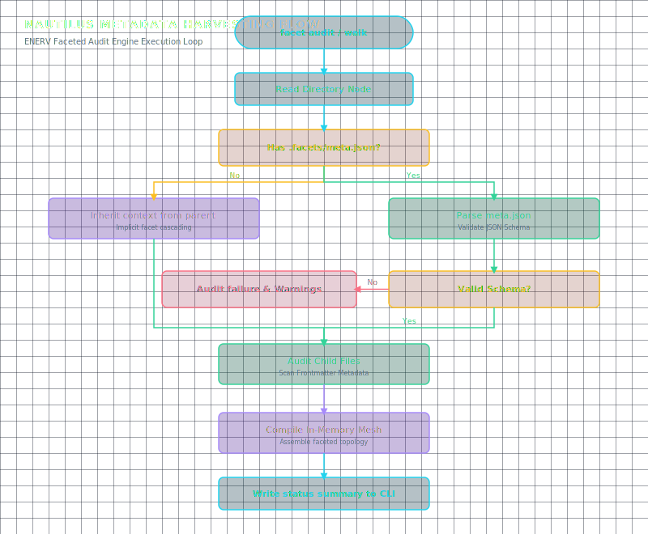

# ENERV: The Metadata Mesh

**ENERV** is the structural compass of the Nautilus environment. It provides a schema-first, lightweight metadata framework that catalogs and validates your directories without incurring the cost of deep semantic ingestion.

<div align="center">
  
</div>

## The Principle of Faceted Indexing

Traditional personal search systems rely on complete full-text indexes. While powerful, full-text indexes lack structural awareness—they cannot tell you if a file belongs to an active project, which engineering team owns it, or its priority level in a sprint. 

ENERV solves this via **Faceted Indexing**. By scanning for metadata boundaries, it constructs an environment map based on hierarchical facets:

1. **Environmental Scope**: Mapped absolute pathways (e.g., `TECH_ROOT`, `KNOWLEDGE_ROOT`).
2. **Context Contracts**: `.facets/meta.json` files that define project attributes.
3. **Implicit Inheritance**: Subfolders inherit metadata attributes from their nearest parent contract unless explicitly overridden, preventing manual duplication.

## The `.facets/meta.json` Schema

Every project directory contains a local configuration file that defines its operational context. An example schema contains:

```json
{
  "$schema": "../../core/enerv/schemas/meta-schema.json",
  "project": "nautilus-core",
  "team": "AI Orchestration",
  "status": "active",
  "priority": "P0",
  "tags": ["knowledge-mesh", "graph-rag", "local-first"]
}
```

ENERV validates these configurations using standard JSON Schemas. If a project declares an invalid status or an unmapped team, the auditing engine flags it immediately.

## Key CLI Operations

- `facet audit`: Recursively scans directories to detect schema violations, broken paths, or orphaned files.
- `facet walk`: Traverses active directories to generate a unified, lightweight system registry, providing the baseline context for AI orchestration layers.
- `facet visualize`: Seamlessly transfers the current directory's metadata context to the 3D Nooscope interface.

---
> [!TIP]
> Use `facet audit` regularly to detect "context drift" across project directories. It acts as a linting tool for your file organization.
