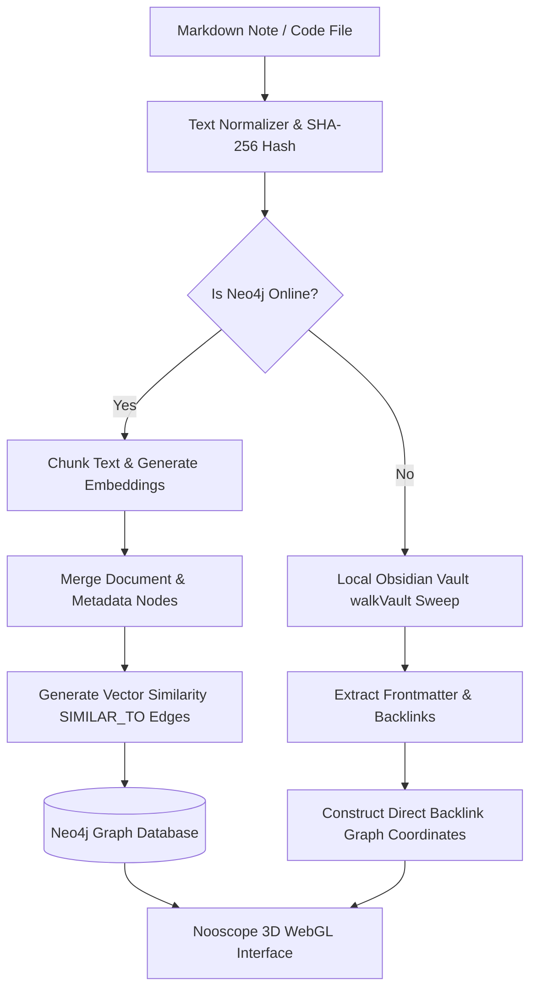

# Knowledge Graph: 3D Visualization & GraphRAG

**The Knowledge Graph** represents the visual and semantic brain of the Nautilus environment. It maps the meaning of your documents, codebases, and ideas in a dynamic 3D coordinate space, linking vector similarity to systemic metadata relationships.

## The Ingestion Pipeline

When you run `facet ingest`, Nautilus executes a multi-stage semantic extraction pipeline:

1. **Normalization & Deduplication**: Text content is stripped of trailing whitespaces and malformed characters. A unique SHA-256 hash is computed for the file. If the hash exists in the database, the ingestion is skipped, preventing node duplication.
2. **Text Chunking**: Files exceeding token boundaries are split into contiguous chunks using a sliding window to preserve context borders.
3. **Embedding Generation**: Chunks are sent to the dynamic LiteLLM gateway (routing by default to high-speed cloud embedders like Google Gemini or falling back to local `BGE-M3` vector engines).
4. **Neo4j Transaction Mapping**:
   - Creates or updates a central `Document` node with metadata attributes (team, status, priority, filepath).
   - Links the document to its respective `Chunk` nodes.
   - Calculates cosine similarity against existing vectors, dynamically forging `SIMILAR_TO` edges to connect related ideas across different projects.

## Visual Intuition: Nooscope 3D UI

The `/apps/knowledge-graph` visualizer runs a WebGL-powered 3D force-directed layout:
- **Interactive Clusters**: Nodes pull together based on semantic similarity and shared project tags, exposing thematic clusters (e.g., all files regarding "SecOps deployment" converge, regardless of whether they exist in `/core/enerv` or `/docs/whitepaper`).
- **GraphRAG Search**: The visualizer features a dedicated sidebar for semantic search. When you query the mesh, the AI fetches the vector neighbors, traverses the graph structure, and feeds a rich GraphRAG context window to the user or agent.

## Resilient Offline Fallback: `walkVault`

A core tenet of the Nautilus architecture is **Sovereignty Under Failure**. If Docker is stopped and the Neo4j database goes offline, the 3D Nooscope UI does not fail:

- **Ambient Traversal**: The system automatically executes a fallback Obsidian note traversal sweep (`walkVault`).
- **Backlink Extraction**: It reads local markdown frontmatter, parses backlinks (e.g., `[[MyOtherNote]]`), and constructs an interactive backlink coordinate network.
- **Result**: You retain a fully functional, highly interactive local-first knowledge graph, even in a total database blackout.

### Visual Transition: From PARA (Tiago Forte) to ACE/LYT (Nick Milo)

The visual design of the Nooscope 3D force layout represents the conceptual shift from **PARA** to **ACE/LYT**:
- **Why PARA Fails in 3D Space**: Under Tiago Forte's PARA model, notes are separated into hard vertical subfolders by "Project" or "Area". In a force-directed WebGL canvas, this forces nodes into separate, disconnected clusters that cannot easily build cross-project connections, causing a fragmented, disjointed "scatter-plot" layout.
- **Why ACE/LYT Thrives in 3D Space**: By structuring notes under Nick Milo's **ACE (Atlas, Calendar, Efforts)** framework, files reside fluidly under unified domains, bridged by **Maps of Content (MOCs)**. On the WebGL canvas, MOCs act as **high-gravity central hub nodes**, beautifully pulling related sub-notes into elegant semantic clusters. This results in an organic, highly interconnected 3D stellar constellation layout, allowing the developer to see holistic conceptual structures emerging naturally.

