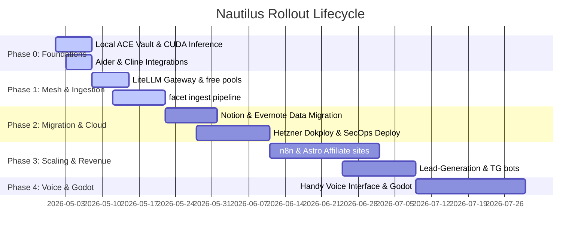

# Phased Roadmap

Nautilus is deployed in modular, progressive iterations. This allows the Solo Vibe Coder to derive immediate utility from local-first markdown notes before committing to heavier Docker architectures or managed database servers.

## Milestone Breakdown

### Phase 0: Stabilize Foundations (Week 1)
- **Local Vault Deployment**: Seed the local Obsidian notes directory using the updated **ACE/LYT Structure** (`Efforts/`, `Atlas/`, `Calendar/`).
- **Local Inference Bootstrapping**: Compile `llama.cpp` using CUDA 13.1 binaries. Download Qwen3-Coder Instruct MoE weights.
- **Agent Workspaces**: Equip Zed and VS Code with Aider and Cline CLI helpers linked to physical-core physical threads.

### Phase 1: Local Ingestion & Proxy Mesh (Weeks 2–3)
- **Centralized Gateway**: Configure LiteLLM proxy router on `localhost:4000`. Establish the rotating pool and recovery fallbacks (Cerebras → Groq → local GGUF).
- **Audit CLI**: Fully deploy the `facet` command-line indexer. Validate all directories using Pydantic JSON contracts.
- **Knowledge Ingest**: Deploy `facet ingest`, enabling direct SHA-256 deduplicated writes to Neo4j. Run structural verification sweeps daily.

### Phase 2: Sovereign Hosting & Migration (Weeks 4–6)
- **Data Consolidation**: Export legacy database notes from Notion and Evernote. Convert to standardized markdown frontmatter and place inside `Atlas/Archives/`.
- **Infrastructure Provisioning**: Deploy Hetzner CX23 server instance using **Dokploy**. Spin up lightweight Docker containers (n8n, Postiz, Qdrant, Wazuh SIEM).
- **SecOps Deployment**: Activate Falco eBPF syscall rules and configure Wazuh active response blocklists integrated into the Cloudflare DNS proxy.

### Phase 3: Scaling & Revenue Layers (Weeks 7–10)
- **Dynamic Content Sites**: Launch static Astro 5 affiliate websites styled with Vanilla CSS and hosted on Cloudflare Pages ($0/mo cost boundary).
- **Autonomous Scrapers**: Provision lead-generation crawlers using Apify or local Playwright scripts.
- **Telegram Channels**: Set up Substack syndication and launch Telegram AI bots using aiogram to deliver weekly curated digests compiled by the Hermes memory sweep.

### Phase 4: Voice & Creative Integrations (Weeks 11–14+)
- **System Tray Voice Controls**: Install offline voice processing via Tauri-based **Handy** linked to Whisper engines, canceling high-cost cloud voice subscriptions.
- **Interactive Simulations**: Integrate the Godot 4.x game engine to construct interactive UI assets or smart contract visualizers.
