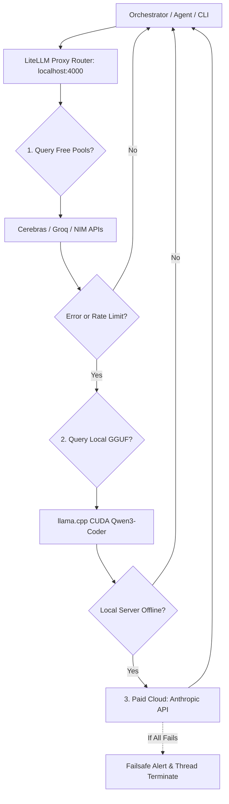

# Technical Stack & Resilient Gateway

Nautilus is engineered as a **sovereignty-first platform**. Every layer of the technical stack is modular, allowing you to swap out cloud providers, databases, or local models in days rather than weeks.

## Model Gateway: LiteLLM Rotating Pool

All models (local and cloud) are consolidated under a single entry point running on `localhost:4000` via **LiteLLM**. Individual consumer scripts see only model aliases, keeping credentials decoupled from application logic. The routing hierarchy is structured to optimize latency, cost, and reliability:

1. **Free Cloud Tiers First**: Utilizes high-speed, zero-cost developer APIs (Cerebras Qwen-3 MoE ~1000 TPS, Groq Llama-3.3-70B, NVIDIA NIM). These are preferred for prompt execution and high-throughput tasks.
2. **Local GGUF Second**: Serves as the absolute, offline-capable sovereignty floor. Powered by `llama.cpp` CUDA binaries running a quantized Qwen3-Coder-30B (MoE) on your GPU (Surface Studio i7/RTX 4060).
3. **Paid Clouds Third**: Leveraged only as a last resort or when a task demands extreme frontier reasoning (e.g., Anthropic Opus/Sonnet API via pay-as-you-go).

## Unified Memory Layers

Memory is split into two asynchronous loops to prevent context bloat:

- **Fast Path (ACE Phase 0)**: Local Obsidian markdown folders (`Efforts/`, `Atlas/`, `Calendar/`). Features automated daily cron consolidation, harvesting durable facts from daily logs and writing summaries to references.
- **Slow Path (Graphiti Phase 1)**: FalkorDB / Neo4j Graph DB combined with a local Qdrant Vector store. Used to resolve complex temporal relationships and track knowledge contradictions.

## SecOps: Sovereign Shield

Deployed on the Hetzner compute host, the **Sovereign Shield** protects your workspace against agent-based prompt injections, vault tampering, and network intrusion:

- **Wazuh Agent**: Monitors File Integrity (FIM) across Obsidian notes directories and monitors system logins.
- **Falco (eBPF)**: Tracks system-level syscalls. Includes rules to detect prompt injections (scanning n8n logs for malicious system prompt commands) and triggers container quarantine protocols on compromise.
- **CrowdSec**: Automatically blocks hostile IP addresses at the Cloudflare DNS and proxy edge.
- **Retaliation Engine**: An autonomous bash script that immediately kills compromised containers, updates iptables, and sends an alert payload to the Coder via Telegram on threat detection.

## Hosting & Compute Boundaries

To protect battery health, avoid residential IP collisions, and prevent system lag, development and production boundaries are strictly isolated:

| Layer | Environment | Technology |
| --- | --- | --- |
| **Local Dev** | Surface Laptop Studio 2 / Win11 Pro | Zed, Aider, Cline, llama.cpp CUDA, Local Obsidian |
| **Edge Compute** | Cloudflare Pages & Workers | Next.js Frontend UI, n8n webhook routing |
| **Sovereign Cloud** | Hetzner CX23 VPS (€3.79/mo) | Dokploy, Docker, Qdrant, Wazuh Server, Postiz |
