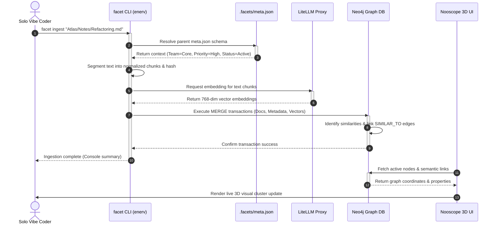

# Synergy: The Integrated Mesh

The ultimate capacity of Nautilus is found in the deep **synergy** between its components. Rather than operating as isolated tools, they build an integrated, self-healing mesh where the operations of each component enrich the other.

## Core Synergistic Workflows

### 1. Metadata-Aware Ingestion
When the coder executes `facet ingest my_note.md`, the ingestion pipeline does not treat the document as a simple, unstructured text dump.
- **Context Boundary Check**: The indexer ascends the directory path to resolve the closest `.facets/meta.json` file.
- **Context Enrichment**: It automatically merges parameters (e.g., project team, priority level, execution status) into the node properties.
- **Multi-Dimensional Graph**: The database creates a node queryable both by raw semantic meaning (vector similarity) and system-wide structural tags (metadata). This allows for complex searches like: *"Find all high-priority notes linked to the game engine database optimization."*

### 2. Dynamic 3D Context Navigation
The `facet visualize` command links the command-line workspace to the visual brain.
- **Instant Mapping**: By analyzing the active working directory, the Next.js visualizer loads the exact node neighborhood on your screen.
- **Emergent Overlaps**: Seeing physical cluster separations allows the developer to identify hidden conceptual redundancies, circular task loops, and structural gaps.

### 3. Agentic Context Injection
Because ENERV and the Knowledge Graph share unified Pydantic schemas, autonomous agents (Aider, Cline) operating in the orchestration layer can execute context-rich operations.
- **Example Scenario**: An agent tasked with "Resolving port collisions" checks the indexer for services listed under `/config/services.json` and simultaneously queries the Graph for all previous incident reports and documentation files containing "port broker design". The agent receives a hyper-focused, bitemporal context package, preventing "context sprawl" and protecting model reasoning performance.

### 4. Unified Lifecycles
A single startup script orchestrates the monorepo's resilient stack:
- **`master-restart.ps1`**: Queries the port broker, allocates free local sockets (LiteLLM, Neo4j, llama-server, Next.js), writes dynamic variables to `.env` and `.env.local`, and bootstraps all services concurrently.
- **Shared `.env`**: A single source of truth for local paths, database logins, and model aliases, preventing environment drift.
