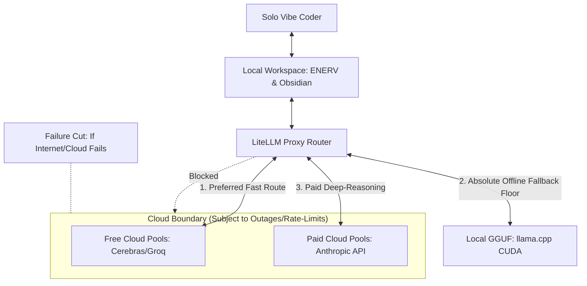

# Vision & Principles

The Nautilus project is built on the philosophy of **Sovereign Solo Vibe Coding**. This approach prioritizes absolute individual autonomy, local control, high-velocity development, and extreme failure resilience.

## Core Principles

### 1. Zero Telemetry & Local First
We reject the modern software-as-a-service model for our personal data and codebases. All core processing — indexing, vector extraction, structural auditing, and graph traversal — occurs locally or within your sovereign cloud (WSL/Local Storage). Opaque third-party tools with closed telemetry boundaries are strictly prohibited. External large language models are treated as stateless, ephemeral compute units rather than permanent databases of truth.

### 2. Memory as a Structured Data Mesh
We believe personal knowledge and code metadata should not be a "lake" of disorganized raw files. Instead, it must be structured as a high-fidelity **Data Mesh**:
- **Immutable Facts**: Every record and daily note has a bitemporal audit trail.
- **Contract-First**: Data schemas are validated against strict JSON contracts, preventing corruption.
- **Sovereign Ownership**: You retain absolute ownership of the indices, vector databases, and decryption keys.

### 3. Pilot-in-Command (Hermes Boss Role)
The orchestration layer (Hermes) serves as the gatekeeper. It prevents sub-agents (Aider, Cline) from corrupting state or bloating contexts. Under this boss-worker paradigm, specialized agents work within strictly mapped context windows.

### 4. Federated Domain Ownership
Knowledge belongs to distinct, autonomous domains (e.g., `Efforts/`, `Atlas/Notes/`, `Calendar/Logs/`). Connections across these domains are managed via federated links, matching the real-world complexity of your projects without centralizing and bloating single-file indices.

### 5. Vibe Coding Synergy
Nautilus is engineered to eliminate systemic friction. Tools work together dynamically by default, allowing the developer to remain in a flow state (focusing on the "vibe" and high-level design) while the system automatically handles metadata, dynamic port allocations, environment variables, and GraphRAG mappings.

---
> [!IMPORTANT]
> The system operates under a **Zero-Telemetry Rule**. Telemetry-heavy IDEs like Trae are blocked, and Zed, Aider, and Cline are used exclusively to maintain privacy.

## Influences, Framework Authors, & Citations

Nautilus is a synthesis of cutting-edge paradigms in Personal Knowledge Management (PKM), software architecture, and agile product development. We stand on the shoulders of giants and proudly cite the following creators whose frameworks inspired the core mechanics of our workspace:

### 1. Nick Milo — The ACE Framework & LYT (Linking Your Thinking)
The **ACE (Atlas, Calendar, Efforts)** directory layout and the concept of **MOCs (Maps of Content)** were designed by **Nick Milo** (author of the *LYT System*). Nautilus adopts this framework for its Fast Path memory tier, recognizing that a fluid, connection-first structural layout is essential to allow AI agents to navigate personal knowledge maps without getting lost in rigid directories.

### 2. Tiago Forte — The PARA Method (Seminal Predecessor & Deprecation Rationale)
The popular **PARA (Projects, Areas, Resources, Archives)** organization methodology was created by **Tiago Forte** (author of *Building a Second Brain*). 

> [!WARNING]
> **Deprecation Notice**: While PARA served as our initial structural layout, it has been **officially deprecated** in Nautilus. 
> * **Why PARA was deprecated**: PARA is strictly project-centric and separates references from action items into isolated vertical folders. This creates rigid compartmentalized silos ("folder jails") that limit an AI agent's capacity to discover multi-hop semantic overlaps or build a unified graph mesh. Moving to Nick Milo's ACE framework allows documents to live fluidly, making them far more compatible with the dynamic nodes-and-edges nature of GraphRAG.

### 3. Jingconan Wang — DeepVista AI Skill Schema
The **DeepVista** modular AI capability schema (`type` x `execution` boundaries) is inspired by the work of **Jingconan Wang** (creator of *DeepVista*, detailed at `deepvista.substack.com`). This schema ensures our Hermes Pilot has deterministic boundaries, making outbound agent writes safe via automated `--dry-run` checkpoints.

### 4. Geoff Charles — Rapid Architect Framing
Our multi-agent parallel research planning workflow is inspired by the product frameworks developed by **Geoff Charles** (VP of Product at Ramp), enabling solo vibe coders to outline high-fidelity specifications through rapid research sweeps in under two minutes.

---

> [!NOTE]
> **Citations Disclaimer**: Nautilus thrives on open cooperation and shared learnings. If you find that we have missed or forgotten to formally credit your work or someone else's work that inspired this monorepo, please contact us or open an issue—we will be absolutely delighted to add the appropriate credit!
