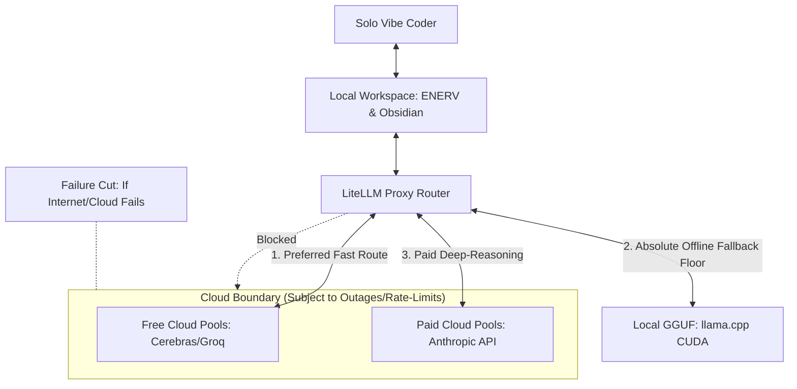

# Vision & Principles

The Nautilus project is built on the philosophy of **Sovereign Solo Vibe Coding**. This approach prioritizes absolute individual autonomy, local control, high-velocity development, and extreme failure resilience.

## Core Principles

### 1. Zero Telemetry & Local First
We reject the modern software-as-a-service model for our personal data and codebases. All core processing — indexing, vector extraction, structural auditing, and graph traversal — occurs locally or within your sovereign cloud (WSL/Local Storage). Opaque third-party tools with closed telemetry boundaries are strictly prohibited. External large language models are treated as stateless, ephemeral compute units rather than permanent databases of truth.

### 2. Memory as a Structured Data Mesh
We believe personal knowledge and code metadata should not be a "lake" of disorganized raw files. Instead, it must be structured as a high-fidelity **Data Mesh**:
- **Immutable Facts**: Every record and daily note has a bitemporal audit trail.
- **Contract-First**: Data schemas are validated against strict JSON contracts, preventing corruption.
- **Sovereign Ownership**: You retain absolute ownership of the indices, vector databases, and decryption keys.

### 3. Pilot-in-Command (Hermes Boss Role)
The orchestration layer (Hermes) serves as the gatekeeper. It prevents sub-agents (Aider, Cline) from corrupting state or bloating contexts. Under this boss-worker paradigm, specialized agents work within strictly mapped context windows.

### 4. Federated Domain Ownership
Knowledge belongs to distinct, autonomous domains (e.g., `Efforts/`, `Atlas/Notes/`, `Calendar/Logs/`). Connections across these domains are managed via federated links, matching the real-world complexity of your projects without centralizing and bloating single-file indices.

### 5. Vibe Coding Synergy
Nautilus is engineered to eliminate systemic friction. Tools work together dynamically by default, allowing the developer to remain in a flow state (focusing on the "vibe" and high-level design) while the system automatically handles metadata, dynamic port allocations, environment variables, and GraphRAG mappings.

---
> [!IMPORTANT]
> The system operates under a **Zero-Telemetry Rule**. Telemetry-heavy IDEs like Trae are blocked, and Zed, Aider, and Cline are used exclusively to maintain privacy.
